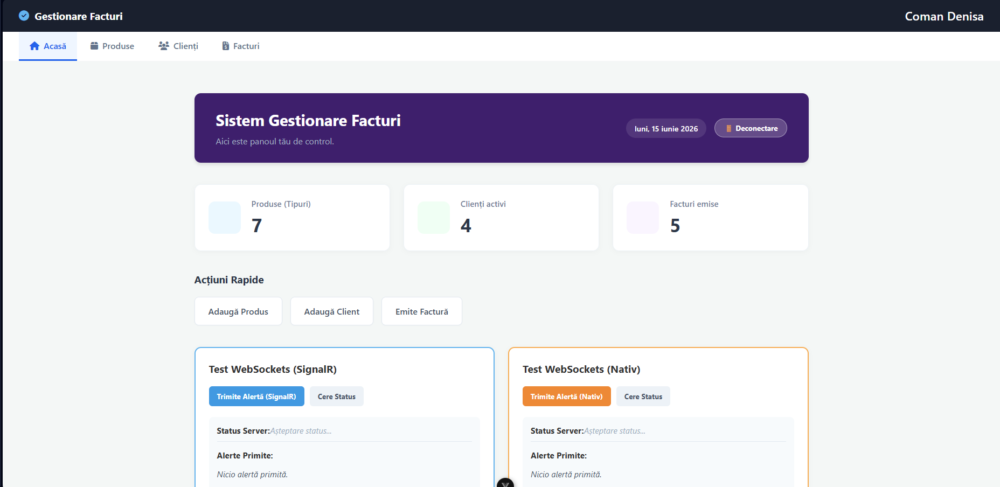
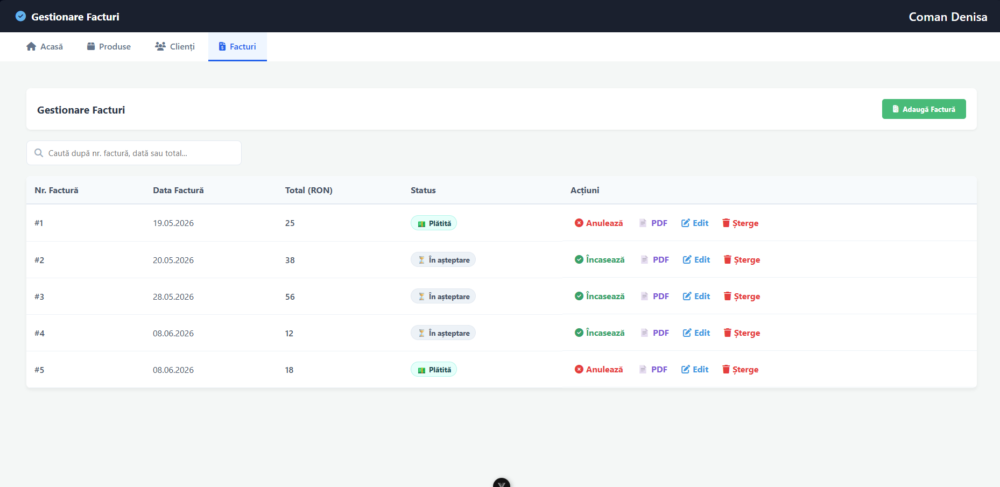
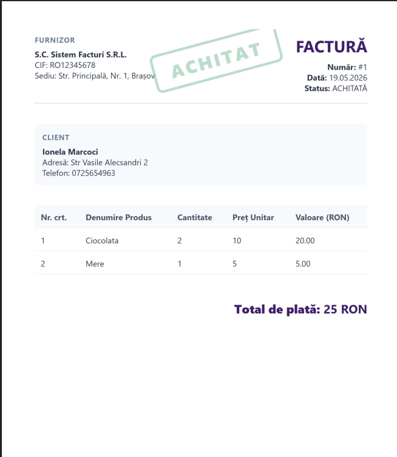
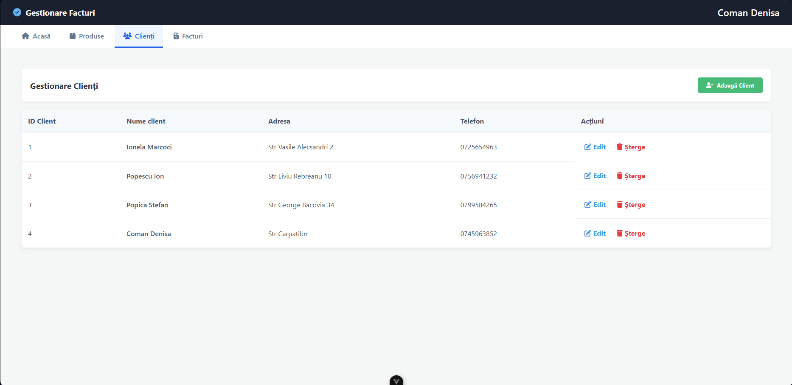

# Invoice Management System (Monolith to Microservices)

A full-stack invoice management application built to demonstrate software architecture evolution. This repository contains two versions of the same business logic: a traditional **Monolithic API** and a modernized **Microservices Architecture** using an API Gateway.

## Tech Stack
* **Backend:** C#, ASP.NET Core 10, Entity Framework Core, SQLite
* **Frontend:** Vue.js, HTML2PDF (for client-side document generation)
* **Architecture:** RESTful APIs, JWT Authentication, Reverse Proxy (API Gateway)
* **DevOps:** Docker, Docker Compose

## Key Features
* **Authentication & Security:** Stateless JWT-based authentication.
* **API Gateway Routing:** Centralized entry point routing requests to isolated microservices.
* **Client-Side PDF Generation:** Optimized server load by generating A4 invoice PDFs directly in the browser.
* **Transactional Inventory:** Automated stock synchronization based on invoice payment status.
* **Automated Database Migrations:** SQLite databases automatically generated via Entity Framework inside Docker containers.

##  Project Structure
This repository is structured to showcase both architectural patterns:
1. `/FrontendM` - The Vue.js single-page application.
2. `/Backend_Monolit` - The initial single-project backend.
3. `/Backend_Microservicii` - The distributed approach containing:
   - `ApiGateway` (Port 5000)
   - `ClientService` (Isolated domain)
   - `ProdusService` (Isolated domain)
   - `FacturaService` (Isolated domain)

## Application Preview

### Main Dashboard & Live WebSockets Control Room
Features high-level business metrics and real-time event testing zones using both SignalR and Native WebSockets implementations.


### Invoice Lifecycle & Status Management
An administrative layout showing transaction statuses, active filters, and inline actions for invoicing operations.


### Client-Side PDF Generation Engine
Optimized billing module that dynamically renders print-ready A4 document layouts with responsive data injection and status stamping.



### Client Directory Management
A structured data table managing entity records, addresses, and full CRUD routing operations.


### Centralized API Gateway Documentation (Swagger UI)
The reverse proxy API Gateway (running on port 5000) automatically aggregates individual OpenAPI/Swagger definitions from all isolated microservices into a single, unified control dashboard.


##  Quick Start (How to Run)

You can run either the Monolithic version or the Microservices version to explore the differences in architecture.

### Option A: Run the Monolith + Frontend
**1. Start the Backend API (Monolith):**
```bash
cd Backend_Monolit/Facturi
dotnet run
```
**2. Start the Frontend (Vue.js):
Open a new terminal window:
```bash
cd FrontendM
npm install
npm run dev
```

Option B: Run the Microservices (Docker)
To test the distributed architecture and API Gateway, ensure you have Docker installed.
Clone the repository:
```bash
git clone [https://github.com/denisa-c10/Invoice-Management.git](https://github.com/denisa-c10/Invoice-Management.git)
Navigate to the microservices backend folder:
```
```bash
cd Backend_Microservicii
```
Spin up the containers:
```bash
docker-compose up --build
Access the centralized API Gateway Swagger UI at: http://localhost:5000
